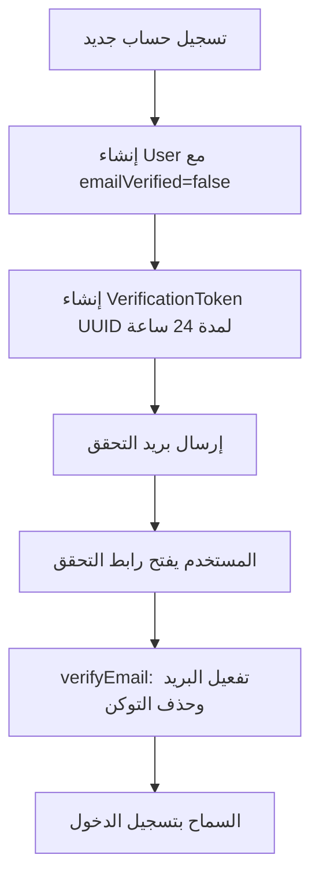

# تأكيد الحساب عبر البريد الإلكتروني (Email Verification)

هذا الملف يوثّق آلية تأكيد الحساب عبر الإيميل عند الإنشاء كما هي مطبّقة حاليًا في النظام.  
التأكيد مخصص (Custom) وليس عبر NextAuth Email Provider.

---

## 1) نظرة عامة

- عند التسجيل يُنشأ المستخدم بحالة: `emailVerified = false`.
- يُنشأ سجل في جدول `VerificationToken` بتوكن UUID وصلاحية **24 ساعة**.
- يُرسل بريد يحتوي رابط تحقق إلى المستخدم.
- لا يُسمح بتسجيل الدخول حتى يصبح `emailVerified = true`.
- بعد نجاح التحقق يُحذف التوكن (استخدام لمرة واحدة).

---

## 2) مخطط التدفق



---

## 3) خطوة بخطوة عند إنشاء الحساب

المصدر الرئيسي: `lib/action/auth/register.ts`  
واجهة التسجيل: `components/auth/RegisterForm.tsx` و`app/(auth)/auth/register/page.tsx`

### الترتيب التنفيذي

1. **Rate limit حسب IP**  
   منع محاولات التسجيل الكثيرة من نفس الجهاز/الشبكة.

2. **التحقق من الحقول** عبر `RegisterSchema`  
   (بيانات الحساب + حقول المتجر إن وُجد خيار إنشاء متجر).

3. **التحقق من التفرد**  
   - البريد غير مستخدم مسبقًا.  
   - اسم المستخدم غير مستخدم مسبقًا.

4. **إنشاء المستخدم في قاعدة البيانات**
   - كلمة المرور مشفّرة بـ `bcrypt`.
   - `emailVerified: false`
   - `isActive: true`
   - الدور: `CUSTOMER` أو `STORE_OWNER` (عند تفعيل إنشاء متجر).

5. **إنشاء توكن التحقق**
   - `token = uuidv4()`
   - `expiresAt = now + VERIFICATION_TOKEN_EXPIRY_MS` (24 ساعة)
   - حفظ السجل في `verification_tokens`.

6. **إرسال بريد التحقق** عبر `sendVerificationEmail` في `lib/email.ts`.

7. **رسالة النتيجة للمستخدم**
   - إذا نجح الإرسال: يطلب التحقق من البريد (ومجلد السبام).
   - إذا فشل الإرسال: الحساب يبقى موجودًا، مع توجيه لإعادة الإرسال من صفحة الدخول، وفي التطوير يُطبع الرابط في الطرفية.

### صيغة رابط التحقق

```text
{baseUrl}/auth/verify-email?token={uuid}
```

حيث يُحدَّد `baseUrl` بهذا الترتيب:

1. `NEXTAUTH_URL`
2. وإلا `https://${VERCEL_URL}`
3. وإلا `http://localhost:3000`

مثال:

```text
https://example.com/auth/verify-email?token=550e8400-e29b-41d4-a716-446655440000
```

---

## 4) عند الضغط على رابط التحقق

الصفحة: `app/(auth)/auth/verify-email/page.tsx`  
المنطق: `lib/action/auth/verify-email.ts` → الدالة `verifyEmail(token)`

### ما يحدث عند فتح الصفحة

1. قراءة `token` من `searchParams`.
2. استدعاء `verifyEmail(token)`.
3. عرض واجهة نجاح أو فشل.

### منطق `verifyEmail`

| الحالة | السلوك |
|--------|--------|
| التوكن فارغ | خطأ: رابط غير صالح |
| التوكن غير موجود | خطأ: رابط غير صالح أو منتهي |
| التوكن منتهي الصلاحية | حذف التوكن + رسالة طلب رابط جديد |
| التوكن صالح | تحديث `User.emailVerified = true` حسب البريد المرتبط بالتوكين، ثم حذف التوكن داخل transaction |

### واجهة الصفحة

- **نجاح:** أيقونة خضراء + رسالة «تم التحقق» + رابط إلى `/auth/login`.
- **فشل:** أيقونة خطأ + نص الخطأ + روابط إلى تسجيل الدخول أو إنشاء حساب جديد.  
  ملاحظة: صفحة التحقق نفسها لا تعرض زر إعادة إرسال مباشر.

---

## 5) إعادة إرسال رابط التحقق

المنطق: `lib/action/auth/resend-verification.ts` → `resendVerificationEmail(email)`  
الواجهة الأساسية: زر داخل `components/auth/LoginForm.tsx`  
صفحة مخصصة موجودة أيضًا: `app/(auth)/auth/resend-verification/`

### متى يظهر زر إعادة الإرسال؟

عند محاولة تسجيل الدخول بكلمة مرور صحيحة وحساب **غير مؤكد**:

- `login` في `lib/action/auth/login.ts` يرجع:
  - رسالة تطلب تأكيد البريد
  - `emailForResend`
- نموذج الدخول يعرض زر **«إعادة إرسال رابط التحقق»**.

### خطوات إعادة الإرسال

1. التحقق أن البريد غير فارغ.
2. البحث عن المستخدم:
   - غير موجود → خطأ: لا يوجد حساب بهذا البريد.
   - مؤكد مسبقًا → خطأ: تم التحقق مسبقًا، يمكن الدخول.
3. حذف كل التوكنات القديمة لنفس البريد (`deleteMany`).
4. إنشاء توكن UUID جديد بصلاحية 24 ساعة.
5. إرسال البريد.
6. عند فشل الإرسال في التطوير: طباعة الرابط في الطرفية عبر `logVerificationUrlDev`.

### ملاحظة مهمة عن المسارات

- `/auth/verify-email` موجود داخل `authRoutes` في `routes.ts` (يمكن للزائر فتحه).
- `/auth/resend-verification` **غير مدرج حاليًا** في `authRoutes`، لذلك قد يعيد الـ middleware الزائر غير المسجّل إلى `/auth/login`.  
  مسار الاستخدام العملي الأساسي هو زر إعادة الإرسال من نموذج تسجيل الدخول (Server Action بدون الحاجة لفتح الصفحة).

---

## 6) منع الدخول قبل التأكيد

الحماية مزدوجة:

### أ) قبل `signIn` — `lib/action/auth/login.ts`

إذا كانت كلمة المرور صحيحة و`emailVerified = false`:

```text
يجب تأكيد بريدك الإلكتروني قبل تسجيل الدخول...
```

مع إرجاع `emailForResend` لعرض زر إعادة الإرسال.

### ب) داخل Credentials Provider — `auth.config.ts`

في `authorize`:

- إذا تطابقت كلمة المرور و`!emailVerified` → `return null` (فشل Credentials).
- إذا تطابقت وكلمة المرور صحيحة والبريد مؤكد → إرجاع المستخدم.

ملاحظة: الجلسة/JWT في `auth.ts` لا تعتمد على حقل `emailVerified` بعد الدخول؛ المنع يتم عند محاولة تسجيل الدخول فقط. لا يوجد فحص `emailVerified` في `middleware` للجلسات القائمة.

---

## 7) قاعدة البيانات

المصدر: `prisma/schema.prisma`

### حقل المستخدم

```prisma
emailVerified Boolean @default(false)
```

### نموذج التوكن

```prisma
model VerificationToken {
  id        String   @id @default(uuid())
  email     String
  token     String   @unique
  expiresAt DateTime

  @@index([email])
  @@index([token])
  @@map("verification_tokens")
}
```

تفاصيل مهمة:

- لا يوجد Foreign Key من التوكن إلى المستخدم؛ الربط يتم عبر نص البريد `email`.
- التوكن يُحذف بعد التحقق الناجح أو عند اكتشاف انتهاء الصلاحية.
- عند إعادة الإرسال تُحذف كل التوكنات السابقة لنفس البريد قبل إنشاء توكن جديد.

---

## 8) إعدادات البريد ومتغيرات البيئة

المصدر: `lib/email.ts`  
مرجع إعداد Gmail: `docs/إعداد_البريد_Gmail.md`

### أولوية إرسال البريد

1. **Gmail SMTP** عبر `nodemailer`  
   - `GMAIL_USER`  
   - `GMAIL_APP_PASSWORD` (تُزال المسافات تلقائيًا إن وُجدت)
2. **Resend API**  
   - `RESEND_API_KEY`  
   - `RESEND_FROM_EMAIL` (افتراضيًا `onboarding@resend.dev`)
3. إن لم يُعد أي مزود: إرجاع خطأ واضح (بدون ادعاء نجاح الإرسال).

### متغيرات رابط التحقق

| المتغير | الاستخدام |
|---------|-----------|
| `NEXTAUTH_URL` | الأساس الأول لرابط التحقق |
| `VERCEL_URL` | أساس احتياطي على Vercel |
| `NODE_ENV` | تفعيل رسائل/طباعة رابط التحقق في التطوير |

### ثوابت الصلاحية

- `VERIFICATION_EXPIRY_HOURS = 24`
- `VERIFICATION_TOKEN_EXPIRY_MS = 24 * 60 * 60 * 1000`

### محتوى البريد

- الموضوع: `تأكيد بريدك الإلكتروني — التحقق من الحساب`
- يحتوي رابط التحقق ويذكر أن الرابط صالح لمدة 24 ساعة.

### في بيئة التطوير

عند فشل الإرسال تستدعى `logVerificationUrlDev` لتطبع في الطرفية:

- البريد المستهدف
- رابط التحقق الكامل لنسخه وفتحه يدويًا

---

## 9) الأمان والحالات الاستثنائية

| الحالة | السلوك الحالي |
|--------|----------------|
| فشل إرسال البريد عند التسجيل | الحساب + التوكن يُنشآن؛ رسالة توضح فشل الإرسال؛ في التطوير يُطبع الرابط |
| فشل إرسال البريد عند إعادة الإرسال | يُرجع خطأ؛ التوكن الجديد موجود؛ التوكنات القديمة حُذفت مسبقًا |
| توكن غير موجود / مستخدم سابقًا | رسالة: رابط غير صالح أو منتهي |
| توكن منتهي | يُحذف + طلب رابط جديد |
| إعادة فتح رابط بعد نجاح التحقق | يفشل لأن التوكن محذوف |
| كلمة مرور خاطئة + حساب غير مؤكد | رسالة بيانات دخول غير صحيحة (بدون زر إعادة إرسال) |
| كلمة مرور صحيحة + حساب غير مؤكد | رسالة تأكيد مطلوبة + زر إعادة إرسال |
| إعادة إرسال لإيميل غير موجود | خطأ: لا يوجد حساب |
| إعادة إرسال لحساب مؤكد | خطأ: تم التحقق مسبقًا |
| Rate limit للتسجيل | مفعّل حسب IP |
| Rate limit لتسجيل الدخول | مفعّل حسب IP |
| Rate limit لإعادة الإرسال | غير موجود حاليًا |
| شكل التوكن | UUID v4 (نص واضح في قاعدة البيانات وفي الرابط) |
| استخدام التوكن | لمرة واحدة فقط |

---

## 10) فهرس الملفات ذات الصلة

| الملف | الدور |
|-------|--------|
| `lib/action/auth/register.ts` | إنشاء الحساب + التوكن + إرسال البريد |
| `lib/action/auth/verify-email.ts` | التحقق من التوكن وتفعيل الحساب |
| `lib/action/auth/resend-verification.ts` | إعادة إرسال رابط التحقق |
| `lib/action/auth/login.ts` | منع الدخول قبل التأكيد + تمرير `emailForResend` |
| `lib/email.ts` | إرسال البريد، صلاحية التوكن، طباعة رابط التطوير |
| `auth.config.ts` | طبقة Credentials التي ترفض الحساب غير المؤكد |
| `auth.ts` | إعداد الجلسة/NextAuth |
| `middleware.ts` | حماية المسارات والتوجيه |
| `routes.ts` | تعريف `authRoutes` و`publicRoutes` |
| `prisma/schema.prisma` | نماذج `User` و`VerificationToken` |
| `app/(auth)/auth/register/page.tsx` | صفحة التسجيل |
| `components/auth/RegisterForm.tsx` | نموذج التسجيل |
| `app/(auth)/auth/verify-email/page.tsx` | صفحة نتيجة التحقق |
| `app/(auth)/auth/resend-verification/page.tsx` | صفحة إعادة الإرسال (مخصصة) |
| `app/(auth)/auth/resend-verification/ResendVerificationForm.tsx` | نموذج إعادة الإرسال |
| `components/auth/LoginForm.tsx` | عرض زر إعادة الإرسال عند الحاجة |
| `docs/إعداد_البريد_Gmail.md` | دليل إعداد مزود البريد |

---

## ملخص سريع

1. التسجيل ينشئ مستخدمًا غير مؤكد + توكن تحقق.  
2. البريد يحمل رابط `/auth/verify-email?token=...` صالحًا 24 ساعة.  
3. فتح الرابط يفعّل `emailVerified` ويحذف التوكن.  
4. الدخول ممنوع قبل التأكيد، مع إمكانية إعادة إرسال الرابط من صفحة تسجيل الدخول.  
5. مزود البريد: Gmail أولًا ثم Resend، مع طباعة الرابط في التطوير عند فشل الإرسال.
